# Devign
> 以下内容为阅读论文所做记录和实验过程记录，非最终实验报告内容，实验报告最终版本见[PDF文件](./实验报告.pdf).
>
> 部分CS224W课程学习笔记：
> - [Traditional Methods for Machine Learning on Graph](https://elubrazione.github.io/2023/11/07/cs224w-traditional-feature-based-methods/)
> - [Node Embeddings](https://elubrazione.github.io/2023/11/09/cs224w-node-embedding/)
> - [Message Passing and Node Classification](https://elubrazione.github.io/2023/11/10/cs224w-message-passing-and-node-classification/)
> - [Graph Neural Network](https://elubrazione.github.io/2023/11/11/cs224w-graph-neural-network/)
> - [Heterogeneous Graphs](https://elubrazione.github.io/2023/11/27/cs224w-heterogeneous-graphs/)


本篇论文的方向是安全邻域的代码漏洞识别问题。
## 背景

最近的研究聚焦了深度神经网络在更自动化的漏洞识别方式上的应用，但现有的方法在学习综合程序语义以表征高多样性、脆弱性以及真实世界的代码的复杂性方面都有很大的局限。可以将现有方法的缺点总结为以下三点：

1）**对源代码结构和逻辑的简化**：传统的学习方法将源代码视为平面序列或仅使用部分信息来表示代码，忽略了源代码的结构性和逻辑性。源代码通常具有抽象语法树、数据流、控制流等复杂的表示方式，这些信息对于准确理解代码含义是至关重要的。

2）**缺乏综合检测漏洞的能力**：源代码中的漏洞有时是微妙的缺陷，需要从语义的多个维度进行综合调查才能发现。然而，现有方法在设计上存在缺陷，限制了其发现各种漏洞的潜力。

3）**训练数据的问题**：部分数据是由静态分析器标注的，这导致了高比例的误分类，即被标记为漏洞但实际上并不是真正的漏洞。另一部分数据是人工编写的简单代码，相比于真实世界的代码过于简单。

## 模型

模型包含三个部分：1）复合代码语义的图嵌入层；2）门控图循环层；3）卷积层模块。各自功能如下：

- 将源代码编码成具有综合程序语义的联合图结构；
- 通过消息传递和消息聚合邻居节点的信息以学习每个节点特征；
- 提取有用的节点表征用于图层面的预测。

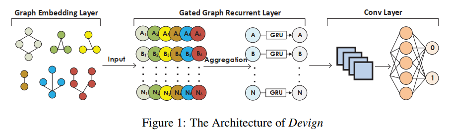

**创新点**：1）首次使用图的数据结构，并将不同层次的程序控制和数据依赖关系编码成一个由异质边 $^{[1]}$ 组成的联合图，每条异质边上的类型表示与相应表征的连接，这样有利于捕获尽可能广泛的漏洞类型和模式，并能够通过图神经网络学习更好的节点表示；2）提出了一个新的带卷积模块的门控图神经网络模型，用于图级别的分类，有利于捕捉更高层次的图特征；3）收集了许多手工标记的数据集并准确、有效验证了模型的性能。

> [1] 异质边（Heterogeneous edges）是指在图结构中连接不同类型节点之间的边。在异质图（Heterogeneous graph）中，节点可以表示不同的实体或概念，而异质边则表示这些实体或概念之间的关系或连接。异质边的存在使得我们能够在图结构中更好地捕捉不同实体之间的复杂关系和连接模式，从而提供更准确和全面的图分析和挖掘能力。异质图在许多现实世界的应用中都很常见。例如，在社交网络中，可以将用户表示为一个类型的节点，将用户之间的关系（如好友、关注关系）表示为另一类型的节点。这样，连接不同类型的节点的边就是异质边。在推荐系统中，可以将用户、商品和标签表示为不同类型的节点，并通过异质边来表示用户与商品之间的交互行为或商品与标签之间的关联。

### 问题抽象

转换为一个二元分类问题，给定一个源代码，判定其是否存在函数级别的代码漏洞。

假设代码数据样本定义为：

$$((c_i,y_i) \mid c_i \in \mathcal{C}, y_i \in \mathcal{Y}), i \in \{ 1,2,...,n \}$$

其中 $\mathcal{C}$ 表示代码中的函数集； $\mathcal{Y}=\\{ 0,1 \\}^{n}$ 中1表示有代码漏洞易受攻击，0表示无； $n$ 是实例个数。

- 把每个函数 $c_i$ 编码成一个多边图 $g_i(V,X,A) \in \mathcal{G}$；
- $m$ 是 $V$ 的节点个数；
- $X \in\mathbb{R}^{m \times d}$ 是初始节点特征矩阵，每个节点 $v_j$ 被表示为一个 $d$ 维的向量 $x_j \in \mathbb{R}^{d}$ （即每个节点的特征是 $1\times d$ ， $V$ 中一共有 $m$ 个节点，因此 $\mathbb{R}$ 的大小是 $m \times d$ ）；
- 邻接矩阵 $A \in \\{ 0,1\\}^{k \times m \times m}$ ，其中 $k$ 是边类型的总数， $e^{p} _ {s,t} \in A$ 等于1表示节点 $v_s$ 和 $v_t$ 通过类型 $p$ 的边相连，否则为0（每个节点都有可能与其它节点有 $p$ 种类型的边相连，因此大小为 $k \times m \times m$ ）

所以模型的目标是学习从 $\mathcal{G}$ 到 $\mathcal{Y}$ 的映射 $f: \mathcal{G} \mapsto \mathcal{Y}$ 来预测一个函数里是否存在漏洞，使用交叉熵损失函数，并使用可调权重 $\lambda$ 进行正则化 $\omega(·)$ ，我们需要做的就是最小化：

$$\sum\limits _ {i=1}^{n} \mathcal{L}(f(g_i(V,X,A),y_i|c_i))+\lambda\omega(f)$$

### 复合代码语义的图嵌入

常见的代码程序表示方法有抽象语法树、控制流和数据流图（编译原理学过的那些）。比较优秀的漏洞检测方法需要结合这三种表示方法形成一个联合数据结构，同时本模型还考虑了源代码的自然序列，即一共四种表示方法。具体做法为：

将函数 $c_i$ 用联合图 $g_i$ 表示，其中四类子图共享同一组节点 $V=V^{ast}$ ，这里的每个节点 $v \in V$ 都有两个属性： $Code$ 和 $Type$ 。 $Code$ 属性通过使用预训练的word2vec模型对源代码进行编码来表示，而 $Type$ 属性则表示节点的类型；然后再将 $Code$ 和 $Type$ 的编码连接在一起，形成初始节点表示 $x_v$ ，以便在后续的图神经网络或图表示学习中使用。这样，每个函数 $c_i$ 都可以通过一个联合图 $g$ 来表示，并且可以利用这个联合图来进行进一步的分析和学习。

### 门控图循环网络

给定一个嵌入图 $g_i(V,X,A)$ ，对于每个节点 $v_j \in V$ ，状态向量 $h^{(1)} _ j$ 被初始化为 $[x^\intercal_j,0]^\intercal$ ，这里因为 $h^{(1)} _j \in \mathbb{R}^z, z \geq d$ ，所以多余的位置被用0来填充。

在每个时刻 $t \leq T$ 中，节点之间通过相应的边类型和方向进行信息传递。邻接矩阵 $A_p$ 描述了从节点 $v_j$ 到其他节点的连接情况，通过在每个时间步中执行这样的邻居聚合操作，可以在整个图中传播和聚合信息，从而使每个节点能够获取来自邻居节点的上下文信息，并将其整合到自身的状态中。

具体，到达 $t$ 时刻，对于某个节点$j$的某种类型 $p$ 拉邻接结点进行信息传播后的结果为：

$$a^{(t-1)} _{j,p} = A^\intercal_p (W_p [h^{(t-1)\intercal} _1,...,h^{(t-1)\intercal} _m] + b)$$

我对以上的公式进行了改造以助于理解：

$$a^{(t-1)} _{j,p} = \sum\limits _ {u \in N(v)} W_p \frac{h^{(t-1)}_u}{\mid N(v) \mid} +b$$

这里 $N(v)$ 表示节点 $u$ 的邻接结点，乘上 $A^\intercal_p$ 就是为了过滤掉非邻接结点。

然后对传递的信息进行聚合，这里 $AGG(·)$ 可以是任何函数，如 $Sum(·)，Mean(·)，Max(·)$ ，CS224W的课程里有提到一般情况下 $Sum(·)$ 性能是最佳的，此论文也用了该函数。

因此当前时刻节点的隐藏状态就可以通过前一时刻的隐藏状态和聚合后的邻居信息表现为：

$$h^{(t)} _j = GRU(h^{(t-1)} _j, AGG( \\{ a^{(t-1)} _{j,p} \\}^k _{p=1}))$$

在经历了$T$时刻这样的更新后， $H^{(T)} _i = \\{ h^{(T)} _j \\}^m _{j=1}$ （即所有节点最后一个隐藏层表示的并集）就是最后集合 $V$ 的节点表示。

### 卷积模块

> 这里就是实验要求实现的部分

应用一维卷积和全连接层来学习与图级任务相关的特征，以获得更有效的预测。定义 $\sigma(·)$ 算子如下：

$$\sigma(·) = MAXPOOL(Relu(CONV(·)))$$

它将输入的特征进行卷积操作，并通过ReLU激活函数进行非线性变换，然后使用最大池化对卷积结果进行下采样。

同时为了利用每个节点本身的信息，devign分别训练了两个卷积模块，得到特征：

$$Z^{(1)} _i = \sigma([H^{(T)} _i, x_i]),...,Z^{(l)} _i = \sigma(Z^{(l-1)} _i)$$

$$Y^{(1)} _i = \sigma(H^{(T)} _i),...,Y^{(l)} _i = \sigma(Y^{(l-1)} _i)$$

最后再将两个特征输入到MLP中，然后对乘法结果进行平均聚合，最后使用Sigmoid激活函数将其映射到[0, 1]的范围内，得到节点的预测结果。

$$\tilde{y_i} = Sigmoid(AVG(MLP(Z^{(l)} _i) \odot MLP(Y^{(l)} _i)))$$

## 代码

### 配置文件

`configs.json` 配置文件包含了各个配置类所需的参数值，用于配置代码的行为和功能。它定义了不同类别的配置参数，如Devign模型、数据创建、路径、文件、代码嵌入和处理等。configs.py文件就是安装 `configs.json` 文件中最外层的键创建了一些对应的类供再上层获取参数，调用的地方就在 `main.py` 。

```python
CREATE_PARAMS = configs.Create()
PROCESS_PARAMS = configs.Process()
PATHS = configs.Paths()
FILES = configs.Files()
DEVICE = PROCESS_PARAMS.device
```

这里的 `DEVICE` 是根据 `torch.cuda.is_available() and self.get_property("use_gpu")`得到的。

这里我总结了一下 `configs.py` 里的类的功能，大致如下：

- Config一个基础配置类，用于加载和访问配置文件中的参数；
- Create类用于访问创建CPG数据相关的配置参数，如过滤条件、切片大小、Joern CLI目录和数据集大小等；
- Data类用于访问数据相关的配置参数，包括CPG数据、原始数据、输入数据、模型数据、标记数据和词向量数据等；
- Paths类用于访问路径相关的配置参数，如CPG数据路径、Joern路径和其他数据路径等；
- Files类用于访问文件相关的配置参数，如原始数据文件、CPG文件、标记文件、词向量文件和模型文件等；
- Embed类用于访问代码嵌入相关的配置参数，如最大节点数、Word2Vec参数和边类型等；
- Process类用于访问训练和评估模型相关的配置参数，如训练轮数、早停策略、批处理大小、设备选择等；
- Devign类用于访问Devign模型相关的配置参数，包括学习率、权重衰减、损失函数参数和模型参数等。

### 任务函数

#### setup()

创建 `Path()` 里定义的文件夹，我们到 `configs.json` 里可以看到，路径为 `data/*`。

```json
"paths": {
    "cpg": "data/cpg/",
    "joern": "data/joern/",
    "raw": "data/raw/",
    "input": "data/input/",
    "model": "data/model/",
    "tokens": "data/tokens/",
    "w2v": "data/w2v/"
},
```

`data/raw`/ 存放着我们在第一步里探索的原始代码数据集，`data/cpg/` 存放着我们从根目录的压缩包里解压出来的用joern工具生成的CPG图。

执行完第二步的 `main.setup()` 就会创建其它文件夹以供后续使用。

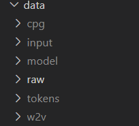

#### embed_task()

画了个代码流程图

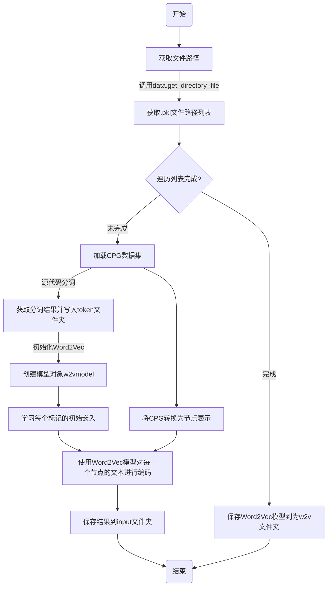

#### process_task()

前半部分是Devign模型初始化，模型初始化的时候用到了configs.Devign()里用到的参数。

```json
"devign": {
    "learning_rate": 1e-4,
    "weight_decay": 1.3e-6,
    "loss_lambda": 1.3e-6,
    "model": {
        "gated_graph_conv_args": {
            "out_channels": 200,
            "num_layers": 6,
            "aggr": "add",
            "bias": true
        },
        "emb_size": 101
    }
},
```

后半部分是训练的代码。

## 实验

### 前置操作

好久没用，check一下本地的环境

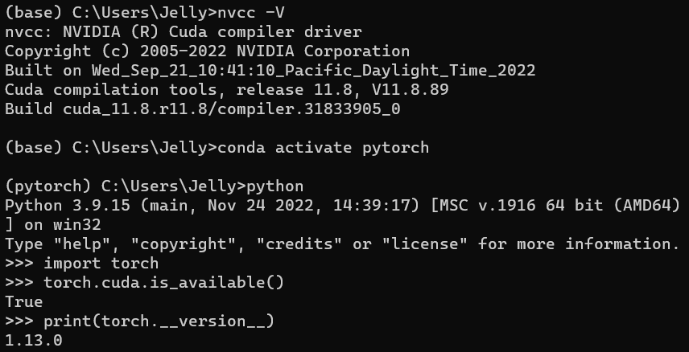

根据torch-geometric官方的教程安装一下这个包（看起来已经迭代到了比较好安装的样子，网上很多以前的安装教程还挺麻烦的）同时根据requirement.txt文件安装一下对应的包。

```bash
conda activate pytorch
conda install pyg -c pyg
pip install -r ./requirements.txt
```

解压一下数据集

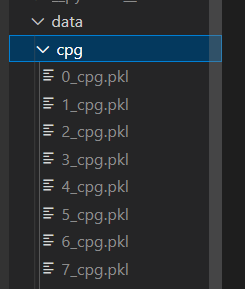

按指南探索一下代码数据集

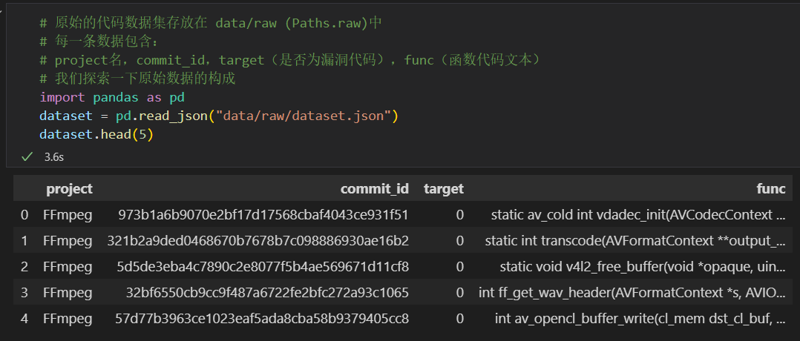

执行第二步代码文本编码，完成word2vec模型的训练

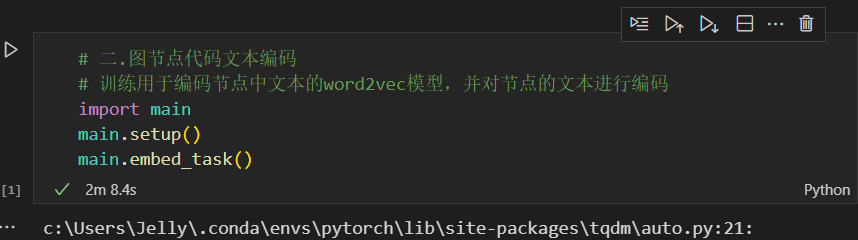

这是控制台调用 `embed_task()` 打印的东西

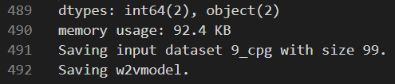

### 代码思路

根据论文里的内容，利用每个节点本身的信息，分别训练了两个卷积模块，最后再将两个特征输入到MLP中，然后对乘法结果进行平均聚合，最后使用Sigmoid激活函数将其映射到[0, 1]的范围内，得到节点的预测结果。按照公式摸出来就行。这里我设计了两个两层的卷积模块和对应的池化层，参数如下：

```py
# 设置卷积层和池化层参数
self.conv1_size = {
    "in_channels": self.max_nodes,
    "out_channels": 64,
    "kernel_size": 3,
    "padding": 1
}
self.conv2_size = {
    "in_channels": 64,
    "out_channels": 16,
    "kernel_size": 2,
    "padding": 1
}
self.maxp1_size = {
    "kernel_size": 3,
    "stride": 2
}
self.maxp2_size = {
    "kernel_size": 2,
    "stride": 2
}

self.feature1 = nn.Conv1d(**self.conv1_size)
self.maxpool1 = nn.MaxPool1d(**self.maxp1_size)
self.feature2 = nn.Conv1d(**self.conv2_size)
self.maxpool2 = nn.MaxPool1d(**self.maxp2_size)
```

对于两个特征 $Z$ 和 $Y$ 对应的卷积层后面都要接全连接层，全连接层的第一个参数由老师给的函数 `get_conv_mp_out_size()` 计算（但是在后面实验的过程中其实遇到了一些小问题）调用传入的第一个参数需要由前面的图神经网络的参数计算，所以需要在初始化函数里添加图神经网络的 `out_channels` 和 `emb_size`，根据公式：

$$Z^{(1)} _i = \sigma([H^{(T)} _i, x_i])$$

$$Y^{(1)} _i = \sigma(H^{(T)} _i)$$

$Z$ 的 $h$ 和 $w$ 应该是`graph_out_chs + emb_size`，而 $Y$ 的 $h$ 和 $w$ 就只有 `graph_out_chs`。

```py
# 根据conv和maxpool参数计算mlp尺寸
self.mlp1_size = get_conv_mp_out_size(
    graph_out_chs + emb_size,
    self.conv2_size,
    [self.maxp1_size, self.maxp2_size]
)
self.mlp2_size = get_conv_mp_out_size(
    graph_out_chs,
    self.conv2_size,
    [self.maxp1_size, self.maxp2_size]
)

self.mlp1 = nn.Linear(1200, 1)
self.mlp2 = nn.Linear(self.mlp2_size, 1)
```

再补充forward函数

```py
def forward(self, h, x):
    z_feature = torch.cat([h, x], 1)
    z_feature = z_feature.view(-1, self.max_nodes, h.shape[1] + x.shape[1])
    out_z = self.maxpool1(F.relu(self.feature1(z_feature)))
    out_z = self.maxpool2(F.relu(self.feature2(out_z)))
    out_z = out_z.view(-1, int(out_z.shape[1] * out_z.shape[-1]))
    out_z = self.mlp1(out_z)

    y_feature = h.view(-1, self.max_nodes, h.shape[1])
    out_y = self.maxpool1(F.relu(self.feature1(y_feature)))
    out_y = self.maxpool2(F.relu(self.feature2(out_y)))
    out_y = out_y.view(-1, int(out_y.shape[1] * out_y.shape[-1]))
    out_y = self.mlp2(out_y)

    out = out_z * out_y
    out = torch.sigmoid(torch.flatten(out))
    return out
```

### 开跑

嗯...好的，把配置文件的 `process.use_gpu` 改成 `false`（破电脑是这样的ToT）然后重启ipynb文件

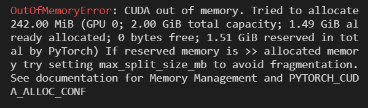

打印显示了 `train with cpu`

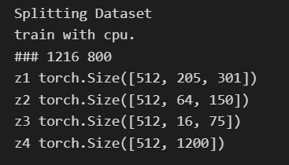

出了bug，调用老师给的函数 `get_conv_mp_out_size()` 算出来的是1216，但是实际是1200所以对不上，暴力修改Linear层的第一个参数为1200。

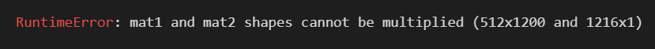

第二个倒是没出问题

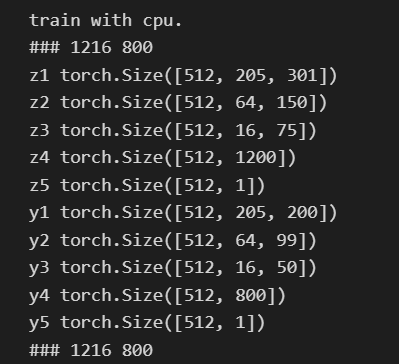

跑出一个batch_loss了

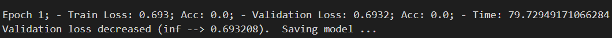

继续放着跑吧，看到 `EarlyStopping=True` 应该是会跑十轮然后自己停

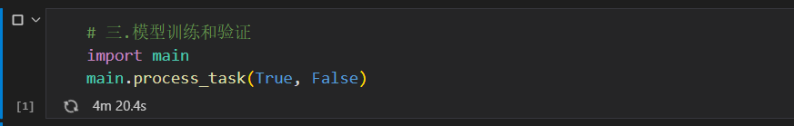

跑完了

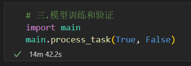

结果

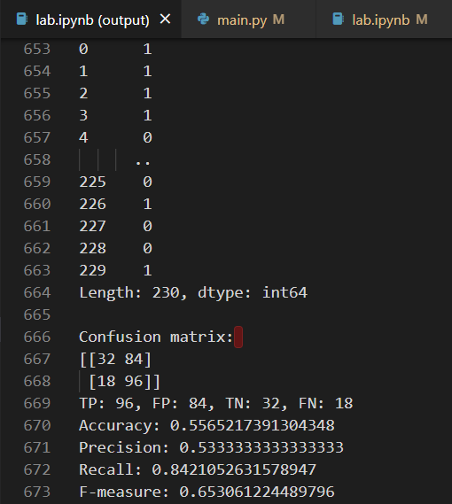
